# Hand gesture detector for multiple objects with SVM and HOG


## About

The project presents a full solution for capturing, retraining and classifieing images with SVM and HOG features. Currently the tranined file can detect and classify multiple hand gestures, pictures below. The last picture shows the scenario where detections are overlapping, in this case the classification is not possible (if like in this case) no similar scenario was trained previously.
<table>
<h1 align="left">
<tr>
  <th>
  <a name="flower" href="">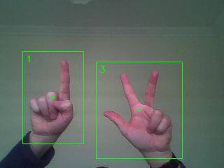</a>
  </th>
  <th>
  <a name="red part" href="">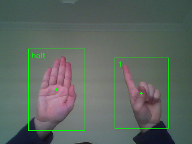</a>
  </th>
  <th>
  <a name="green part" href="">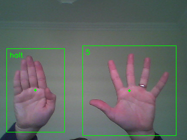</a>
  </th>
    <th>
  <a name="green part" href="">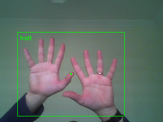</a>
  </th>
</tr>
</h1>
</table>

The flow of the detection and classifications, starts with low level filtering (skin color detector), followed by a contour selector. The role of the contour selector is to identify the regions of interest (ROI) where the object for classification can be found. Image patches like below are collected and stored in directories for a database creation. Images are normalized before saveings, to obtain better detection performance.
<table>
<h1 align="left">
<tr>
  <th>
  <a name="flower" href="">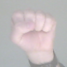</a>
  </th>
  <th>
  <a name="red part" href="">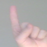</a>
  </th>
  <th>
  <a name="green part" href="">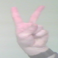</a>
  </th>
  <th>
  <a name="green part" href="">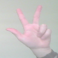</a>
  </th>
  <th>
  <a name="green part" href="">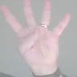</a>
  </th>
  <th>
  <a name="green part" href="">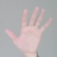</a>
  </th>
  <th>
  <a name="green part" href="">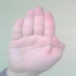</a>
  </th>
  <th>
  <a name="green part" href="">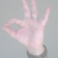</a>
  </th>
</tr>
</h1>
</table>

After createing a sufficiently big database ~100 pictures / class, the SVM training can start. Will take only a few secounds and an xml file will be saved which holds everrything needed for further detections.


## Usage

From Command line:
```
usage: gesture_detector.py [-h] -l labelfile [-t trainedfile] [-cmd commands]
                           [-d detectionswindow] [-c cameraid] [-s samplesize]
                           [-dir traindirectory] [-dd detectiondir]
                           [-ani annotatedimages] [-sf saveframe]
                           [-sp savepatches]

optional arguments:
  -h, --help            show this help message and exit
  -l labelfile          label file, like ./label.txt
  -t trainedfile        file which holds the trained values like, ./data.xml
  -cmd commands         commands available for processing: [retrain,
                        savedetections, creatlabelfile, run], default=run
  -d detectionswindow   show/ hide detection window [0,1], default=0
  -c cameraid           use different camera ID, default=0
  -s samplesize         select the training sample size, default=96
  -dir traindirectory   directory with ordered pictures per detection classes
  -dd detectiondir      directory to save the detections or image patches for
                        training set creation
  -ani annotatedimages  save annotated images, [0,1] default=0
  -sf saveframe         save original camera frames, [0,1] default=0
  -sp savepatches       save image detections (patches), [0,1] default=0
```
### Retrain
```
1. Create directory structure to store the files
2. Create labels file
3. Capture and copy files under the desired folders
4. Instruct software for retrain
```
#### 1. Create directory structure

Is recommandet to start from the root of the python file, and create a directory like "data", than create under this folder directories equivalent to the classes what are needed for the classification part. Similar than below.
```
├── data
│   ├── 0
│   ├── 1
│   ├── 2
│   ├── _2
│   ├── 3
│   ├── 4
│   ├── 5
│   ├── face
│   ├── halt
│   ├── ok
│   ├── tmp

```
#### 2. Create labels file

The tool itself provide means for saving image regions, this is fitting to the needs. First we need the label file, then the rest is easy.
```
python3 ./gesture_detector.py -l ./labels.txt -cmd creatlabelfile -dir ./data
```
Now, label file was created, contect is somethng like this:

```
1,_2,/home/vfe/PycharmProjects/test/data/_2
2,5,/home/vfe/PycharmProjects/test/data/5
3,face,/home/vfe/PycharmProjects/test/data/face
4,2,/home/vfe/PycharmProjects/test/data/2
5,ok,/home/vfe/PycharmProjects/test/data/ok
#6,tmp,/home/vfe/PycharmProjects/test/data/tmp
7,4,/home/vfe/PycharmProjects/test/data/4
8,0,/home/vfe/PycharmProjects/test/data/0
9,1,/home/vfe/PycharmProjects/test/data/1
10,halt,/home/vfe/PycharmProjects/test/data/halt
11,3,/home/vfe/PycharmProjects/test/data/3
```

Unneeded directoryes like "tmp" - used to store temporary images, can be commented, the label loader will skip it. The format is simple, first element is the UID (unique identifier), label name - edit it to whatever want to show on detections. Last is the directory for the specific label.

#### 3. Capture and copy files under the desired folders

Use the following command to save images into a temp directory:
```
python3 ./gesture_detector.py -l ./labels.txt -t -dd ./data/tmp -sf 1 -sp 1
```
This will capture regions for detection, and the frames on which the regions were detected. If just patches are needed use just -sp 1 command.
Now, comes the hard work of selectiong and coping the specific image patches under the desired directorys.

#### 4. Instruct software for retrain

Use the following command for retrain:
```
python3 ./gesture_detector.py -l ./labels.txt -t ./data.xml -cmd retrain
```
When everithing has gone well with the retrain, the software starts automatically. The data.xml will be automatically saved, threfore for nex run only:
```
python3 ./gesture_detector.py -l ./labels.txt -t ./data.xml
```

### Future work

Implement validation funtion and detection accuracy for fine tunings.

## Resources

[Python OpenCV tutorial](https://opencv-python-tutroals.readthedocs.io/en/latest/py_tutorials/py_imgproc/py_colorspaces/py_colorspaces.html#converting-colorspaces).


/Enjoy.
